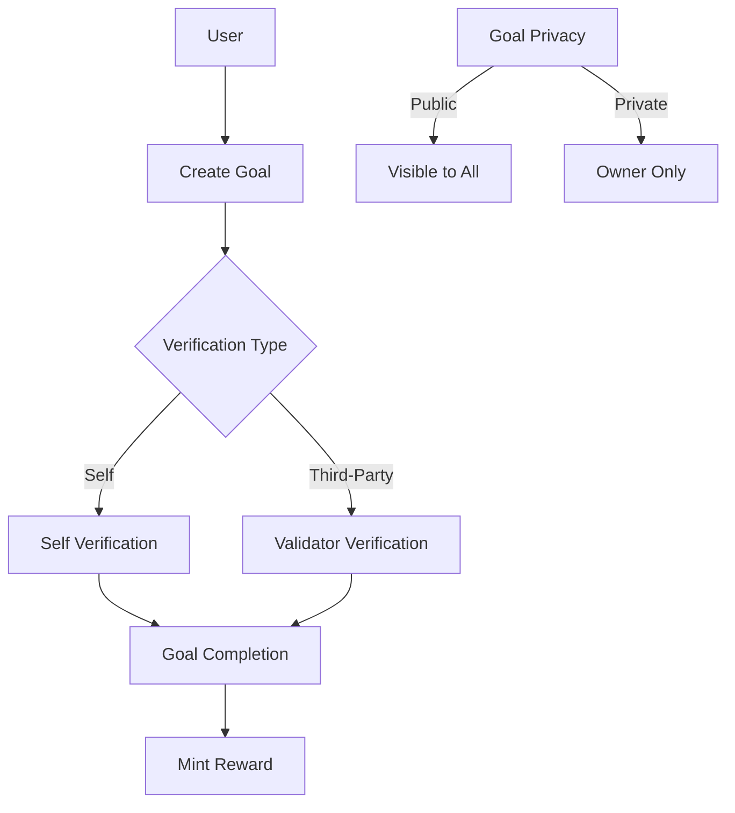

# Forward Moralis: Blockchain Goal Achievement Platform

A decentralized goal-setting platform that transforms personal achievements into tangible digital rewards on the Stacks blockchain. Forward Moralis enables users to create, track, and verify personal goals while earning unique digital rewards for their accomplishments.

## Overview

Forward Moralis is designed to motivate personal growth through blockchain-based achievement tracking and gamification. The platform allows users to:

- Create customized goals with detailed parameters and milestones
- Track progress through milestone completion
- Choose between self-verification or third-party validation
- Earn unique digital rewards for completed achievements
- Maintain privacy control over their accomplishments
- Build a verifiable on-chain record of achievements

## Architecture

The Forward Moralis platform is built on a single core smart contract that manages all goal-setting and verification functionality.



### Core Components

1. **Goal Management**
   - Goal creation with custom parameters
   - Milestone tracking
   - Progress updates
   - Privacy controls

2. **Verification System**
   - Self-verification option
   - Third-party validator support
   - Verification records

3. **Reward System**
   - Achievement validation
   - Digital reward minting
   - Completion tracking

## Contract Documentation

### achievement-tracker.clar

The main contract handling all platform functionality.

#### Key Features

- Goal creation and management
- Milestone tracking
- Verification system
- Privacy controls
- Reward minting

#### Access Control

- Goal owners can:
  - Create and modify goals
  - Update milestones
  - Control privacy settings
  - Mint rewards
- Validators can:
  - Verify assigned goals
- Public can:
  - View public goals

## Getting Started

### Prerequisites

- Clarinet
- Stacks wallet

### Installation

1. Clone the repository
2. Install dependencies with Clarinet
3. Deploy contracts to the desired network

### Basic Usage

```clarity
;; Create a new goal
(contract-call? .achievement-tracker create-goal 
  "Learn Clarity" 
  "Complete the Clarity tutorial series" 
  u1000 
  u1 ;; Self-verification
  u1 ;; Public
  (list "Complete basics" "Build first contract")
)

;; Update milestone
(contract-call? .achievement-tracker update-milestone u1 u0 true)

;; Complete goal
(contract-call? .achievement-tracker complete-goal u1)
```

## Function Reference

### Goal Management

```clarity
(create-goal (title (string-ascii 100)) 
            (description (string-utf8 500)) 
            (deadline uint) 
            (verification-type uint) 
            (privacy uint) 
            (milestones (list 10 (string-ascii 100))))
            
(update-milestone (goal-id uint) (milestone-index uint) (completed bool))

(complete-goal (goal-id uint))

(verify-goal (goal-id uint) (verification-notes (string-utf8 200)))
```

### Reward System

```clarity
(mint-goal-reward (goal-id uint))
```

### Privacy Controls

```clarity
(update-goal-privacy (goal-id uint) (privacy uint))
```

## Development

### Testing

1. Run the test suite:
```bash
clarinet test
```

2. Deploy to testnet:
```bash
clarinet deploy --testnet
```

### Local Development

1. Start Clarinet console:
```bash
clarinet console
```

2. Deploy contracts:
```bash
(contract-call? .achievement-tracker ...)
```

## Security Considerations

### Limitations

- Goal verification relies on trusted validators
- Reward minting is basic implementation
- Privacy is binary (public/private)

### Best Practices

1. Always verify goal ownership before modifications
2. Check goal status before operations
3. Validate all input parameters
4. Consider deadline constraints
5. Monitor validator permissions

### Data Security

- Goal privacy settings are enforced at the contract level
- Validator lists are immutable once set
- Achievement records are permanent on-chain
- Only goal owners can modify privacy settings